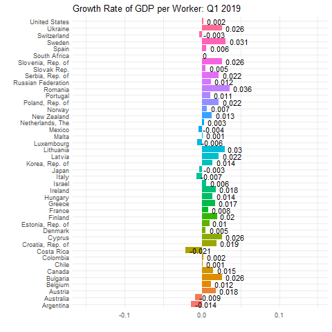

```{r}
#install.packages("ggiraph")
#install.packages("gifski")
library(ggiraph)
library(gifski)
library(ggiraph)
library(readr)
library(tidyverse)
library(dplyr)
library(socviz)
library(ggthemes)
library(plotly)
library(gganimate)

imf_growth <- read_csv(url('https://bcdanl.github.io/data/imf_growth_quarterly.csv'))

imf_growth <- imf_growth %>%
  mutate(gy = round(gy, digits = 3))

p <- ggplot(imf_growth, aes(x = country, y = gy, fill = country)) +
  geom_col() +
  geom_text(aes(label = as.character(gy), hjust = -.2)) +
  coord_flip()

# fig_1 <- p + transition_states(quarter, transition_length = 1, state_length = 1) +
#   labs(title = "Growth Rate of GDP per Worker: {closest_state}", x = "", y = "") +
#   theme_minimal() + theme(legend.position = "none")

#fig_1

#animate(fig_1, renderer = gifski_renderer("growth.gif"))

```


```{r}
library(socviz)
library(readr)
library(ggthemes)
library(plotly)
climate_opinion <- read_csv(
  'https://bcdanl.github.io/data/climate_opinion_2021.csv')

typeof(climate_opinion$id)
climate_opinion$id <- as.character(climate_opinion$id)


map <- county_map
map$id <- as.numeric(map$id)
map$id <- as.character(map$id)
climate_map <- left_join(map, climate_opinion, by = "id")


na_map <- function(yr){
  county_full_na <- filter(climate_map, is.na(belief)) %>% 
    select(-belief) %>% 
    mutate( belief = yr)
}

for (val in  levels( factor(climate_map$belief) )  ){
  climate_map <- rbind(climate_map, na_map(val))
}

climate_map <- climate_map %>% 
  mutate(belief_desc = ifelse(belief == "happening",
                              "Global warming is happening.",
                              "Global warming is mostly caused by human activities."))

county_full_1<- climate_map %>% 
  filter(belief == "human")
county_arizona <- county_full_1 %>%
  filter(str_detect(GeoName, ", Arizona") == TRUE)

county_full_1$GeoName <-
  iconv( x = county_full_1$GeoName
         , from = "UTF-8"
         , to = "UTF-8"
         , sub = "" )

x1 <- ggplot(data = county_full_1) + 
  geom_polygon(mapping = aes(x = long, y = lat, 
                             group = group, fill = perc, text = GeoName ),
               color = "grey60", size = 0.1) 

x2 <- x1 + scale_fill_gradient2( 
  low = '#2E74C0',  
  high = '#CB454A',  
  mid = 'white', # transparent white
  na.value = "grey80",
  midpoint = 50,
  breaks = c(quantile(climate_map$perc, 0, na.rm = T),
             quantile(climate_map$perc, .25, na.rm = T),
             quantile(climate_map$perc, .5, na.rm = T),
             quantile(climate_map$perc, .75, na.rm = T),
             quantile(climate_map$perc, 1, na.rm = T)),
  labels = c(paste(round(quantile(climate_map$perc, 0, na.rm = T), 1),"(Min)"),
             paste(round(quantile(climate_map$perc, .25, na.rm = T), 1),"(25th)"),
             paste(round(quantile(climate_map$perc, .5, na.rm = T), 1),"(50th)"),
             paste(round(quantile(climate_map$perc, .75, na.rm = T), 1),"(75th)"),
             paste(round(quantile(climate_map$perc, 1, na.rm = T), 1),"(Max)")
  ),
  guide = guide_colorbar( direction = "horizontal",
                          barwidth = 25,
                          title.vjust = 1 )
) 

x <- x2 + labs(fill = "Percent Belief", title = "U.S. Climate Opinion, 2021: Global warming is mostly caused by human activities.") +
  theme_map() + 
  theme(plot.margin = unit( c(1, 1, 3.85, 0.5), "cm"),
        legend.position = c(.5, -.3),
        legend.justification = c(.5,.5),
        strip.background = element_rect( colour = "black",
                                         fill = "white",
                                         color = "grey80" ))+
  guides(fill = guide_colourbar(direction = "horizontal", barwidth = 25, title.vjust = -1))


# fig_climate <- ggplotly(x, useBytes = F) %>% 
#   layout(title = list(text = paste0("U.S. Climate Opinion, 2021",
#                                     '<br>',
#                                     '<sup>',
#                                     'Global warming is mostly caused by human activities',
#                                     '</sup>')),
#          annotations = 
#            list(x = 1, y = -0.15, 
#                 text = "Sources: Yale Program on Climate Change Communication\n(https://climatecommunication.yale.edu/visualizations-data/ycom-us/)", 
#                 showarrow = F, xref='paper', yref='paper', 
#                 xanchor='right', yanchor='auto', xshift=0, yshift=0))
# 
# widg <- fig_climate
# library(htmlwidgets)
# saveWidget(widg, file=paste0( getwd(), "/climate_opinion_map_interactive.html"))


```
````{=html}
```{r, echo = T, echo=FALSE, results='asis'}
xfun::file_string(paste0( getwd(), "/climate_opinion_map_interactive.html"))
```
````

